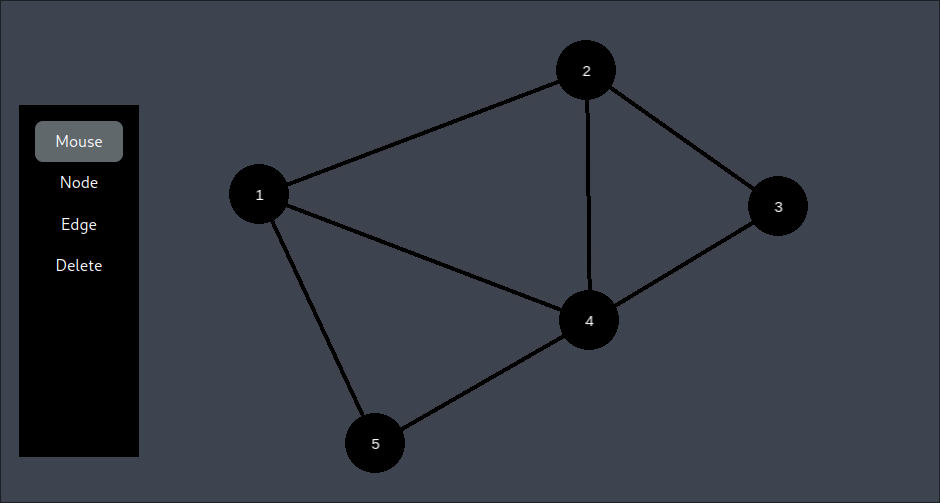

# Graph Playground

Create graphs in an interactive canvas



- Easily drop in new nodes
- Draw connections between nodes
- Move nodes around easily

## Start

```bash
npm install
npm run dev
```

## Goals

- Looks + feels good
- Export images of the graph
- Run algorithms on it e.g. shortest path
